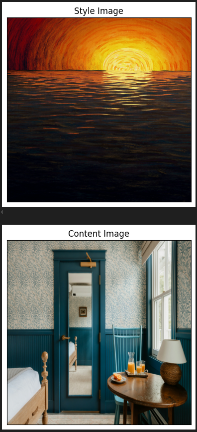
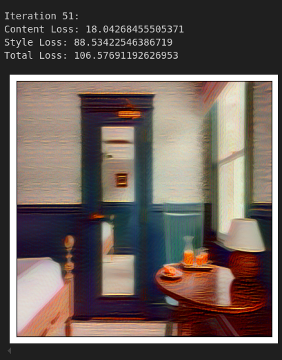
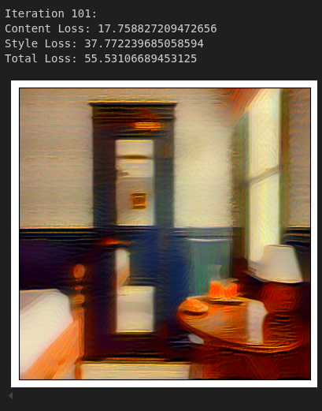
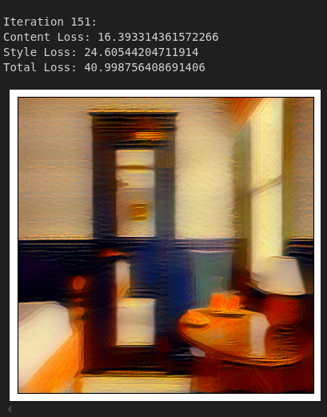

# Convolutional Neural Networks and Neural Style Transfer

A comprehensive guide to implementing Convolutional Neural Networks (CNNs) and Neural Style Transfer (NST) from scratch. This project provides a deep dive into the fundamental concepts and practical application of these powerful computer vision techniques.

👉 **Note:** This project is developed as part of the **Applied Data Science course at Sharif University of Technology**.  
👉 Repository Link: [GitHub Repo](https://github.com/Amirreza81/Applied-Data-Science-Course)  

---

## 🚀 Project Overview

This repository contains the source code and documentation for a project focused on understanding and implementing key components of deep learning for computer vision. The work is divided into two main sections:

1.  **Convolutional Neural Networks (CNNs)**: We build a basic convolutional layer from the ground up, implementing both the **forward and backward passes**. This hands-on approach provides a clear understanding of how convolution operations, including strides and padding, function beneath the surface.
2.  **Neural Style Transfer (NST)**: Building on the CNN foundation, we implement Neural Style Transfer to combine the content of one image with the artistic style of another. This section demonstrates how to use pre-trained models like **VGG19** to extract features for calculating **content loss** and **style loss**.

---

## 🧠 Core Concepts

### Convolutional Neural Networks (CNNs)

* **What it is:** A type of deep learning model specialized for image and spatial data, inspired by the human visual system.
* **Why use it:** CNNs automatically learn features (like edges, shapes, and objects), reducing the need for manual feature engineering. They are the backbone of many computer vision tasks, including **image classification**, **object detection**, and **face recognition**.
* **Key components:**
    * **Convolution Layer**: Applies filters to input images to create feature maps.
    * **Pooling Layer**: Reduces the spatial dimensions of the feature maps, helping to control model size and complexity.
    * **Fully Connected Layer**: Traditional neural network layer for classification or regression.
    * **Output Layer**: Produces the final result of the network.

### Neural Style Transfer (NST)

* **What it is:** An AI technique that combines the content of one image with the artistic style of another. The output is a new image that retains the structure of the content image while adopting the texture, color, and patterns of the style image.
* **Key Idea:** The process involves two inputs: a **content image** (e.g., a photo) and a **style image** (e.g., Van Gogh's *Starry Night*). The goal is to generate an output image that minimizes two main losses:
    * **Content Loss**: Ensures the generated image maintains the structural elements of the content image.
    * **Style Loss**: Ensures the generated image's texture and artistic elements match the style image.
* **How it works:** An iterative optimization process that passes images through a pre-trained CNN (like VGG19), computes the content and style losses, and updates the generated image to minimize the total loss.

---

## 🛠️ Implementation Details

The core implementation is a Jupyter Notebook (`cnn_and_nst.ipynb`) that includes:

* **`MyConv` Class**: A custom Python class that implements a convolutional layer's `forward` and `backward` passes using NumPy.
* **Gradient Checks**: Numerical gradient checks are included to verify the correctness of the backward pass implementation.
* **Visualization**: Code to visualize the effect of different filters on sample images.
* **Loss Calculation**: Demonstrates how to calculate both content and style losses to drive the style transfer process.

---

## 📈 Results

The project successfully demonstrates the ability to implement foundational CNN components from scratch and apply them to a creative and visually compelling task like Neural Style Transfer. The outputs show a clear blend of content and style, validating the effectiveness of the approach.

